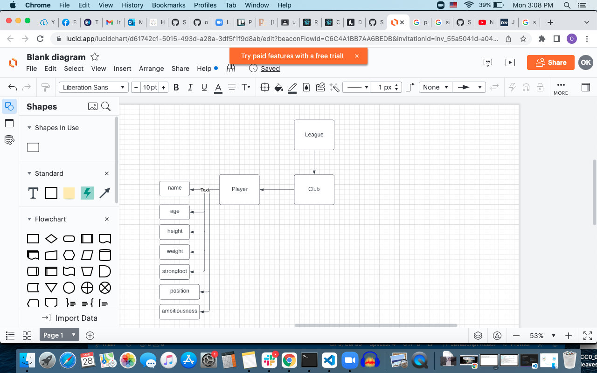

# **Project 2 : Social Organizer**

## **Idea**

this app will organize the users social life by making a list of contacts a user can search, modify, add to and remove from.

the available text fields for inputting contact info are:

### _The Contacts: name_

### _The Contacts: age_

### _The Contacts: gender_

### _The Contacts: relationship_

### _The Contacts: country_

### _The Contacts: state_

### _The Contacts: email_

### _The Contacts: phone_

Then there's the ' Add ' Button that is pressed once data has been typed for the contact. Then the contact is submitted.

Also, there will be a ' Search Tools ' button that pulls up search tools.

I plan to make my APP able to search the database by name, age, gender, relationshio, country, state, email, phone or even a combination of attributes. That way the user can, for example, search for all the people from the country of 'Brazil' who are '25' years old. Or all the people who have the name "Ryan Garcia"...etc.

After the search has been submitted, the results will be displayed.

## _Results_

The returned results will be displayed in a div components with an h1 of the full name of the contact. Below it there will be Relationship (between user and contact), age and gender.

Yet below that, there wil be the state and city of the contact.

And, below that, finally, there will be the email and phone number.

## _Modifying Results_

The user will be able to select the contact they wish to delete or modify. and either click on a button with the text of ' delete ' or ' edit '

when a contact is selected and the ' delete ' button is clicked, the contact is ' deleted '

if a contact is selected and the ' modify ' button is clicked, the input field with the contact's info typed will pop up and the user can then change the info and click ' modify ' to change the info.

Trello

https://trello.com/b/tOwx3543/project-2-social-organizer
